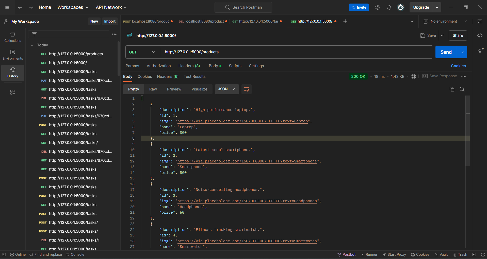
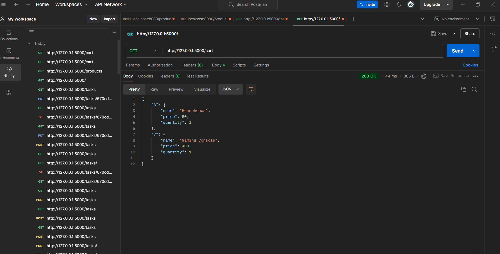
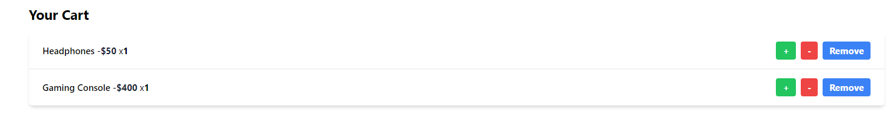

# Product-Cart-API
The Product Cart API is a RESTful web service designed to facilitate a simple e-commerce platform. Built using Flask, this API enables users to view products, manage a shopping cart, and perform essential CRUD (Create, Read, Update, Delete) operations on the cart.

## Features

- Retrieve a list of all available products.
- Add products to the shopping cart.
- Update the quantity of items in the cart.
- Remove items from the cart.
- Cross-origin resource sharing (CORS) enabled for seamless frontend-backend communication.

## Technologies Used

- Python
- Flask
- Flask-CORS
- React (for the frontend)

## Prerequisites

Before you begin, ensure you have the following installed:

- Python 3.x
- Node.js and npm

## Installation

### Backend Setup

1. **Clone the repository:**

   ```bash
   git clone <repository-url>
   cd <repository-directory>
   ```

2. **Install the required packages:**

   Install Flask and Flask-CORS:

   ```bash
   pip install Flask Flask-CORS
   ```

### Frontend Setup

1. **Navigate to the frontend directory:**

   ```bash
   cd templates
   ```

2. **Install the necessary dependencies:**

   ```bash
   npm install
   ```

## Running the Application

### Starting the Backend

To start the Flask application, run:

```bash
python app.py
```

The API will be available at `http://127.0.0.1:5000/`.

### Starting the Frontend

To start the React application, run:

```bash
npm run dev
```

The frontend will be available at `http://127.0.0.1:3000/`.

## API Endpoints

### 1. Get All Products

- **GET** `/products`
  - Returns a list of all available products.
  - 
  
### 2. Get Cart Details

- **GET** `/cart`
  - Returns the current state of the shopping cart.
  - 

### 3. Add Item to Cart

- **POST** `/cart`
  - Request body should include:
    - `product_id`: The ID of the product to add (required).
    - `quantity`: The quantity of the product to add (optional, defaults to 1).
  - Example request:

    ```json
    {
        "product_id": 1,
        "quantity": 2
    }
    ```

### 4. Update Item Quantity

- **PUT** `/cart/<product_id>`
  - Request body can include:
    - `quantity`: The new quantity of the item (required).
    - 
  - Example request:

    ```json
    {
        "quantity": 3
    }
    ```

### 5. Remove Item from Cart

- **DELETE** `/cart/<product_id>`
  - Deletes the specified item from the cart.
  - 

## License

This project is licensed under the MIT License.
